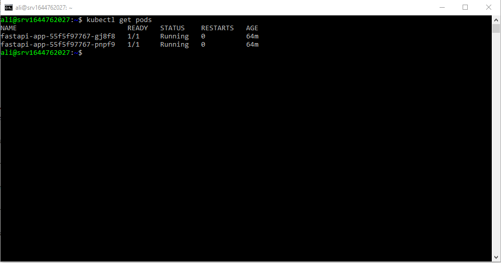
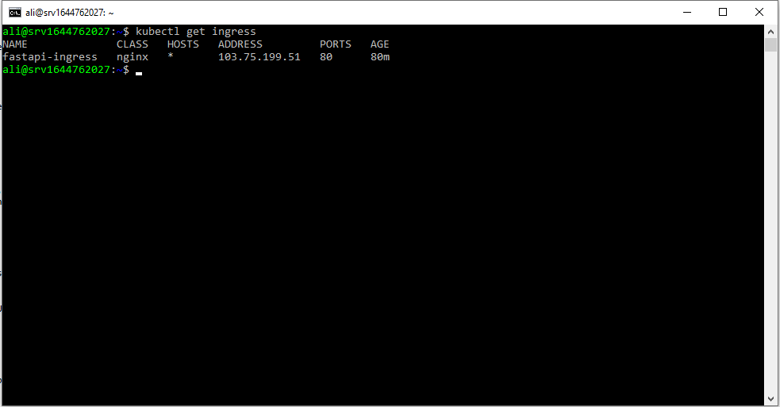
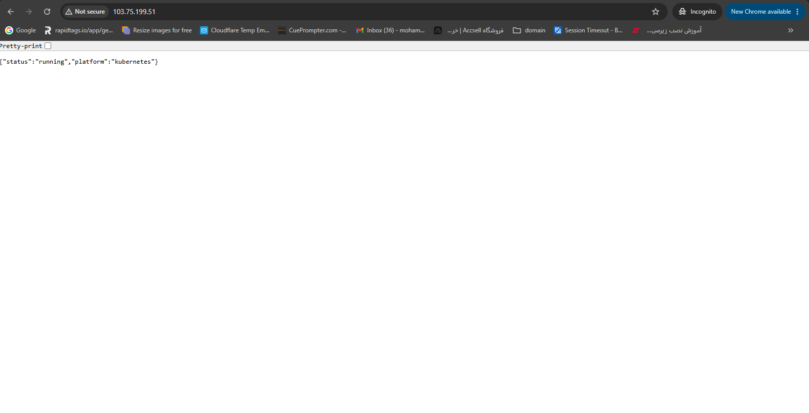
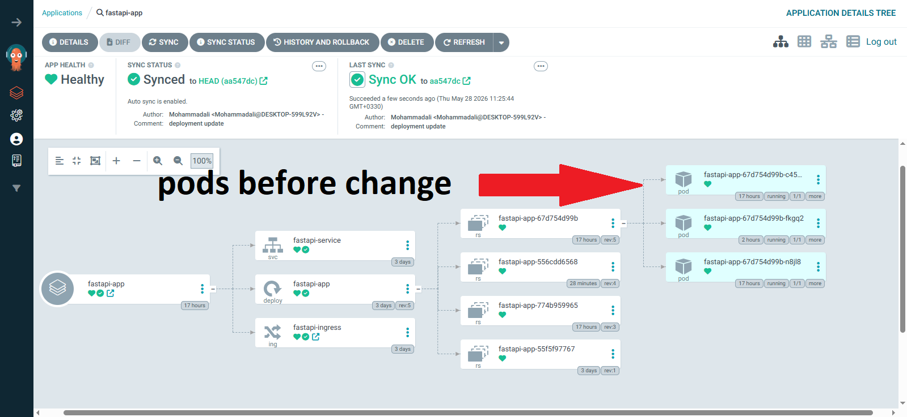
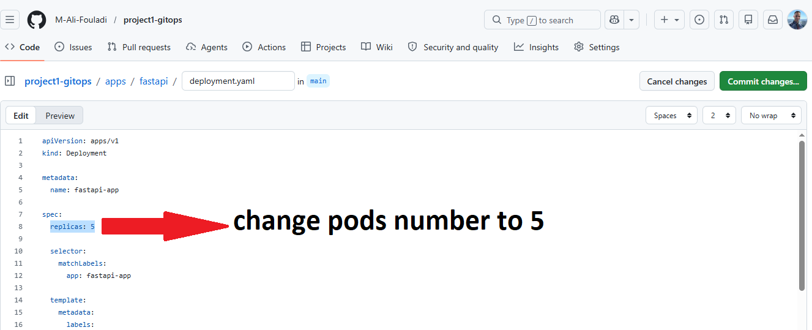
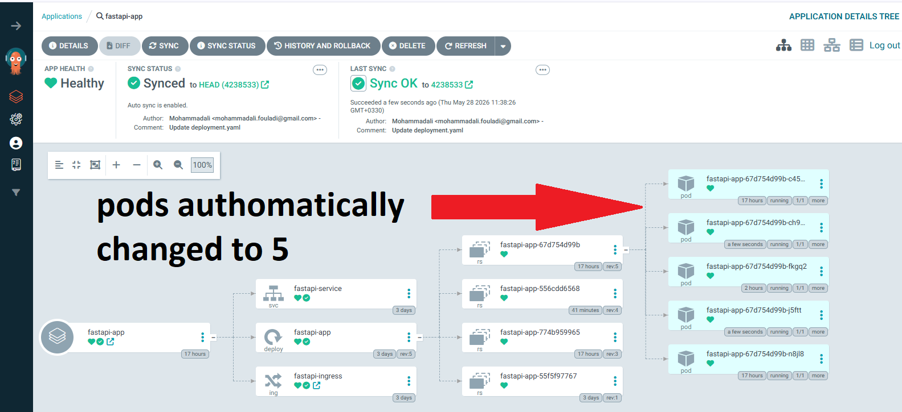

# Cloud Native GitOps Platform
# Deployment Screenshots

## Kubernetes Pods



---

## Kubernetes Ingress



---

## Running Application



## ArgoCD App Overview before changing pods 



## change pods in deployment for testing ArgoCD-autosync 



## ArgoCD App Overview after changing pods 



A production-style cloud-native platform built with Kubernetes, Docker, GitHub Actions, and GitOps principles.

This project demonstrates a real-world DevOps workflow for deploying and managing containerized applications on a Kubernetes cluster using modern cloud-native tooling.

---

# Project Goals

The purpose of this project is to showcase practical experience with:

* Kubernetes orchestration
* Docker containerization
* GitOps workflows
* CI/CD automation
* Infrastructure monitoring
* Production-style deployments
* Cloud-native architecture

This project is designed as a portfolio-grade DevOps platform running on a self-managed Kubernetes cluster.

---

# Architecture

```text
Developer
   |
GitHub
   |
GitHub Actions
   |
Container Registry
   |
ArgoCD (GitOps)
   |
Kubernetes Cluster (k3s)
   |
-----------------------------------
| FastAPI | Redis | PostgreSQL |
-----------------------------------
   |
NGINX Ingress
   |
Internet
```

---

# Tech Stack

## Infrastructure

* Ubuntu Server
* Docker
* Kubernetes (k3s)
* Helm

## CI/CD & GitOps

* GitHub Actions
* ArgoCD

## Backend

* FastAPI
* Uvicorn

## Monitoring

* Prometheus
* Grafana
* Loki

## Networking

* NGINX Ingress Controller
* TLS / HTTPS

## Databases

* PostgreSQL
* Redis

---

# Features

* Containerized FastAPI application
* Kubernetes deployments and services
* GitOps continuous delivery workflow
* Automated CI/CD pipelines
* Health checks and readiness probes
* Metrics endpoint for Prometheus
* HTTPS ingress routing
* Centralized monitoring and observability
* Rolling deployments
* Production-style architecture

---

# Project Structure

```text
cloud-native-gitops-platform/

├── app/
│   ├── main.py
│   └── requirements.txt
│
├── docker/
│   └── Dockerfile
│
├── k8s/
│   ├── deployment.yaml
│   ├── service.yaml
│   ├── ingress.yaml
│   ├── postgres.yaml
│   └── redis.yaml
│
├── monitoring/
│   ├── prometheus/
│   └── grafana/
│
├── .github/
│   └── workflows/
│       └── deploy.yml
│
├── README.md
├── .gitignore
└── .dockerignore
```

---

# FastAPI Application

The platform includes a lightweight FastAPI service exposing:

## Endpoints

### Root Endpoint

```text
GET /
```

Response:

```json
{
  "status": "running"
}
```

---

### Health Check

```text
GET /health
```

Used for Kubernetes liveness and readiness probes.

---

### Metrics Endpoint

```text
GET /metrics
```

Exposes Prometheus metrics for monitoring.

---

# Docker

The application is packaged into a Docker container using a production-style Dockerfile.

Container features:

* Lightweight Python image
* Dependency caching
* Non-interactive deployment
* Optimized image layers

---

# Kubernetes Deployment

The application is deployed on a Kubernetes cluster using:

* Deployment
* Service
* Ingress
* Configurations for scaling and reliability

The cluster is powered by k3s running on Ubuntu.

---

# CI/CD Pipeline

The CI/CD workflow is implemented using GitHub Actions.

Pipeline stages:

1. Run automated tests
2. Build Docker image
3. Push image to container registry
4. Trigger deployment update
5. ArgoCD syncs Kubernetes manifests

This workflow enables automated and repeatable deployments.

---

# GitOps Workflow

ArgoCD continuously monitors the Git repository and automatically synchronizes Kubernetes resources with the cluster state.

Benefits:

* Declarative deployments
* Version-controlled infrastructure
* Automatic synchronization
* Easy rollback support

---

# Monitoring & Observability

The platform includes monitoring components for production visibility.

## Prometheus

Collects metrics from Kubernetes and the FastAPI application.

## Grafana

Visualizes infrastructure and application metrics through dashboards.

## Loki

Aggregates container and application logs.

---

# Security

Basic security hardening includes:

* HTTPS ingress
* Kubernetes probes
* Resource limits
* Isolated containers
* Firewall configuration
* SSH hardening

---

# Deployment Workflow

```text
Code Push
   ↓
GitHub Actions
   ↓
Docker Build
   ↓
Container Registry
   ↓
ArgoCD Sync
   ↓
Kubernetes Deployment
```

---

# Future Improvements

Potential future enhancements include:

* Horizontal Pod Autoscaling (HPA)
* Blue/Green deployments
* Canary deployments
* Terraform Infrastructure as Code
* Multi-node Kubernetes cluster
* Cloudflare integration
* OpenTelemetry tracing
* Chaos engineering
* Automated backup strategies

---

# Why This Project Matters

This project demonstrates several real-world DevOps and cloud engineering concepts:

* Kubernetes orchestration
* Cloud-native deployments
* GitOps workflows
* Infrastructure automation
* Observability
* Production-style operations
* CI/CD pipelines
* Container lifecycle management

These practices are commonly used in modern enterprise cloud environments.

---

# License

This project is intended for educational and portfolio purposes.
